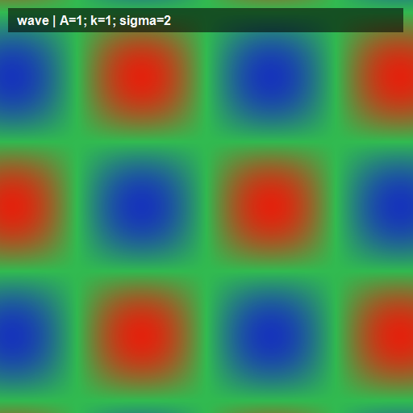
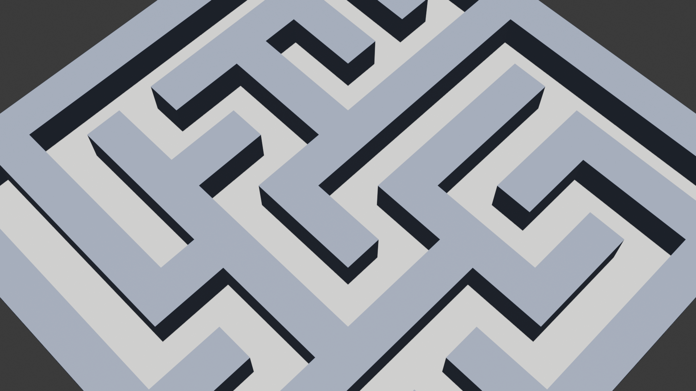
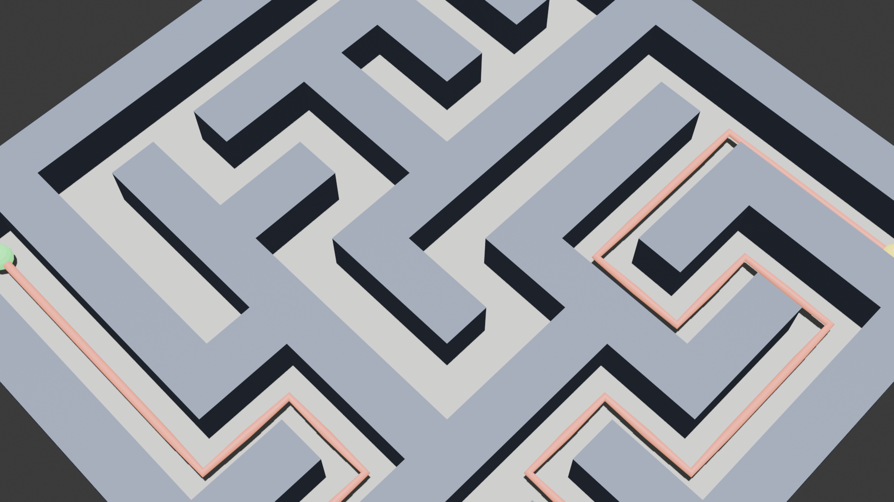

# Математика в 3D: от формулы к маршруту

**Ознакомительная методичка по Blender + Python**

*Предмет:* математика + информатика + 3D-технологии
*Класс:* 10–11 / первый курс
*Инструменты:* Blender 4.x/5.x, Python 3.10+
*Время:* 2–3 учебных часа

---

## Введение

Математика в учебнике — это символы на бумаге. Увидеть, *как на самом деле
выглядит* формула $z = \sin(x) \cdot \cos(y)$, без 3D-инструмента почти
невозможно. А потом ещё объяснить, как компьютер находит путь в лабиринте.

Эта методичка — короткая экскурсия по трём маленьким идеям:

1. **Формула становится формой.** Любая функция двух переменных — это
   поверхность в пространстве. Мы зададим её одной строчкой Python и
   увидим 3D-модель.
2. **Лабиринт как мир из кубиков.** Любую сетку из нулей и единиц можно
   превратить в Blender-сцену. Каждая «единица» — один куб.
3. **Компьютер ищет выход.** Алгоритм A\* (произносится «эй-стар»)
   находит кратчайший путь в лабиринте за доли секунды. Мы увидим,
   как он это делает — и увидим сам маршрут в 3D.

**Как читать:** три акта, три картинки, три команды для запуска.
Весь код лежит в репозитории, в папке `scripts/`. В методичке — только
ключевые сниппеты и объяснения.

**Что нужно установить:**
- Blender 4.5 или новее ([blender.org](https://www.blender.org/), бесплатно)
- Python 3.10+ (идёт в комплекте с Blender, отдельно не нужен)

**Как запустить:**
```bash
git clone <репозиторий>
cd stem-blender-math-visualization
blender --background --python scripts/visualize_function.py -- --function wave
```

---

## Акт 1. Формула становится формой



*Поверхность $z = \sin(x) \cdot \cos(y)$ в 3D. Цвет — по высоте:
синий внизу, красный наверху.*

### Что мы видим

На картинке — **мягкая рябь**, как на поверхности воды. Впадины и горки
чередуются по диагоналям. Это одна формула. Без компьютера её так не
увидеть — можно только вообразить по графикам сечений.

### Как это работает

Функция двух переменных $z = f(x, y)$ задаёт поверхность: для каждой
точки $(x, y)$ на плоскости есть своя высота $z$.

Алгоритм построения:

1. Берём **сетку точек** на плоскости. Например, 100 × 100 точек в
   квадрате от $-5$ до $5$ по обеим осям.
2. Для каждой точки считаем $z = f(x, y)$ — получаем тройку $(x, y, z)$.
3. Отдаём все тройки Blender'у. Blender соединяет соседние точки
   четырёхугольниками — получается поверхность.
4. Красим поверхность **по высоте**: чем выше $z$, тем краснее;
   чем ниже — тем синее.

### Ключевой код

```python
import math

def wave(x, y):
    return math.sin(x) * math.cos(y)

# сетка 100×100 в квадрате [-5, 5]
vertices = []
for i in range(100):
    for j in range(100):
        x = -5 + i * 0.1
        y = -5 + j * 0.1
        z = wave(x, y)
        vertices.append((x, y, z))
```

Всё остальное — создание mesh'а, настройка камеры, покраска — лежит в
`scripts/visualize_function.py` и `scripts/function_library.py`. Посмотри
туда, если интересно, как это устроено.

### Запуск

```bash
blender --background --python scripts/visualize_function.py -- \
    --function wave --output assets/renders/wave_A1_k1.png
```

Замени `wave` на `paraboloid`, `saddle`, `ripple` или `gaussian` — получишь
другие поверхности. Все готовые рендеры для сравнения лежат в
`assets/renders/`.

### Задание для ученика

Открой `scripts/function_library.py` и найди там функцию `wave`. Измени
коэффициент частоты и перегенерируй картинку. Как изменился рельеф?
А теперь придумай свою функцию — например, $z = x^2 - y^2$. Что получится?

---

## Акт 2. Лабиринт как мир из кубиков



*Лабиринт $15 \times 15$, сгенерированный случайно. Каждая стена —
один куб в Blender-сцене.*

### Что мы видим

Настоящий 3D-лабиринт. Но внутри программы он выглядит просто —
**таблица нулей и единиц**. Ноль = пол (можно ходить), единица = стена
(нельзя). Blender берёт эту таблицу и для каждой единицы ставит куб.

### Как это работает

1. **Сетка данных.** Берём матрицу размера $N \times N$ из нулей и единиц.
2. **Генерация лабиринта.** Используем алгоритм *рекурсивного бэктрекинга*:
   ставим «копателя» в клетку, прорубаем коридоры в случайных направлениях,
   откатываемся, когда упёрлись в тупик. В итоге получается связный
   лабиринт без изолированных комнат.
3. **Отрисовка.** Для каждой клетки-единицы вызываем
   `bpy.ops.mesh.primitive_cube_add(location=(x, y, 0.5))`. Всё. Пол —
   один большой плоский прямоугольник под всем лабиринтом.

### Ключевой код

```python
import bpy

maze = [  # 1 = стена, 0 = пол
    [1,1,1,1,1],
    [1,0,0,0,1],
    [1,0,1,0,1],
    [1,0,0,0,1],
    [1,1,1,1,1],
]
for y, row in enumerate(maze):
    for x, cell in enumerate(row):
        if cell == 1:
            bpy.ops.mesh.primitive_cube_add(location=(x, y, 0.5))
```

В реальном скрипте (`scripts/pathfinding/visualize_labyrinth_in_blender.py`)
стены сделаны одним большим mesh'ом, а не десятками отдельных кубов —
это быстрее при рендере. Но идея та же самая: «единица → куб».

### Запуск

```bash
blender --background --python scripts/pathfinding/visualize_labyrinth_in_blender.py -- \
    --rows 15 --cols 15 --seed 7 --no-path \
    --output assets/renders/labyrinth_cubes.png
```

Меняй `--seed` — получишь каждый раз новый лабиринт. Меняй `--rows` и
`--cols` (нечётные числа) — изменишь размер.

### Задание для ученика

Запусти скрипт с размером $25 \times 25$ и `--seed 1`, потом $25 \times 25$
и `--seed 2`. Сравни лабиринты. Почему они разные, если код один и тот же?
Что такое *seed* и зачем он нужен?

---

## Акт 3. Компьютер ищет выход



*Тот же лабиринт. Алгоритм A\* за долю секунды нашёл кратчайший
путь от зелёной точки к жёлтой. Маршрут — розовая линия.*

### Что мы видим

Компьютер не «смотрит» на лабиринт глазами. Ему нужно **правило**, по
которому решать: в какую клетку идти дальше? Правил много. Самое популярное
для поиска пути — алгоритм **A\*** (А-звёздочка).

### Как работает A\* (простыми словами)

Представь, что ты стоишь на старте и держишь в голове список
«клеток на рассмотрение».

1. Смотришь на соседей текущей клетки.
2. Для каждого соседа считаешь две цифры:
   - **g** — сколько шагов уже прошёл от старта до этой клетки;
   - **h** — сколько шагов *по прямой* осталось до финиша (это называют
     *эвристика* — приблизительная оценка остатка пути).
3. Складываешь: **f = g + h**. Это оценка, «насколько перспективна»
   эта клетка.
4. Идёшь в клетку с **наименьшим f**.
5. Повторяешь, пока не придёшь в финиш.
6. По дороге запоминаешь: «в клетку X я пришёл из клетки Y». В конце
   разматываешь эту цепочку назад — получаешь сам маршрут.

**Почему это работает:** эвристика $h$ не даёт алгоритму «блуждать»
в противоположную от финиша сторону. Без $h$ (это уже алгоритм Dijkstra)
компьютер проверяет гораздо больше клеток, но всё равно находит ответ.

### Ключевой код

```python
import heapq

open_set = [(0, start)]            # (оценка f, клетка)
g_score = {start: 0}
came_from = {start: None}

while open_set:
    _, current = heapq.heappop(open_set)
    if current == goal:
        break
    for neighbor in neighbors(current):
        tentative_g = g_score[current] + 1
        if tentative_g < g_score.get(neighbor, float("inf")):
            g_score[neighbor] = tentative_g
            f = tentative_g + heuristic(neighbor, goal)
            heapq.heappush(open_set, (f, neighbor))
            came_from[neighbor] = current
```

Это сердце A\*. Весь боевой код (с препятствиями, разными алгоритмами
и весами ребер) — в `scripts/pathfinding/search.py` и `cost_functions.py`.

### Запуск

```bash
blender --background --python scripts/pathfinding/visualize_labyrinth_in_blender.py -- \
    --rows 15 --cols 15 --seed 7 --algorithm astar \
    --output assets/renders/labyrinth_solved.png
```

Поменяй `--algorithm astar` на `--algorithm dijkstra`. Маршрут получится
таким же (или почти таким же по длине), но в логе `посещено=...` —
Dijkstra проверит больше клеток, потому что у него нет эвристики.

### Задание для ученика

1. Запусти A\* и Dijkstra на одном и том же лабиринте (один `--seed`).
   Сравни значения «посещено узлов» в логе. Во сколько раз A\* эффективнее?
2. Придумай свою эвристику. Что будет, если $h = 0$ всегда? А если
   $h$ в 10 раз больше реального расстояния до финиша?

---

## Заключение

Три картинки — три разных мира внутри одной 3D-сцены:

- **поверхность** — мир, заданный формулой;
- **лабиринт** — мир, заданный таблицей;
- **маршрут** — мир, заданный алгоритмом.

Во всех трёх случаях математика и программирование работают вместе:
Python считает, Blender показывает. Это и есть основа вычислительной
геометрии, компьютерной графики и игр — от школьного уровня до игровых
студий.

**Куда двигаться дальше:**

- Поверхность с препятствиями. Можно искать путь не только в плоском
  лабиринте, но и по горам — см. `scripts/pathfinding/visualize_path_in_blender.py`
  и рендеры `assets/renders/path_*.png`.
- Geometry Nodes: интерактивный эквивалент того же, что мы делали кодом,
  только мышкой в Blender'е. См. `scripts/setup_geometry_nodes_surface.py`.
- Более подробная методичка с разбором каждого файла проекта лежит
  в `docs/metodichka/old/методичка_подробная.md` — она для тех, кому
  интересна «внутрянка».

Полный код всех скриптов — в папке `scripts/` репозитория.
